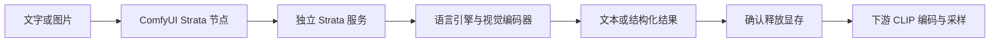

# ComfyUI 节点与 VisionReady 整合包规划

记录日期：2026-10-06。状态：已实施，当前结果见 [验收记录](VALIDATION-COMFYUI-T8.md)。以下保留实施前的审查记录。本轮已由主 Agent 与一个独立子 Agent 核对源码并讨论；以下为功能范围、技术方案和验收门槛，不代表功能已经实现。

用户确认：文本处理、图片理解和 ComfyUI 内自动启动/加载/卸载三个部分全部需要；整合包应包含视觉权重和配置。现有 v0.1.39-t8.4 是不含任何权重的发行版，后续 VisionReady 包改变的是视觉部分，主模型 GGUF 与 MTP 仍另行分发。

## 可行性与架构

建议使用轻量 ComfyUI 节点调用独立 Strata HTTP 服务。ComfyUI 使用自身 Python 运行节点，Strata 使用整合包中的 Python、CUDA/HIP 和原生引擎；节点不向 ComfyUI 环境安装 Strata 的 CUDA、numpy 或引擎依赖。

Strata 现有 Chat Completions、模型发现、加载和卸载接口已经能承担主要功能。首版统一使用 Chat Completions 协议，避免为同一任务维护三套兼容路径；通过能力查询判断视觉、结构化输出及生命周期操作是否可用。

提供两种连接模式：

- **托管本机**：选择 Strata 整合包和主模型目录，节点按需启动后台服务，等待就绪；记录 PID、进程创建时间、路径、端口和实例标识，只结束自己启动的进程。
- **连接服务**：填写已有服务地址；默认只请求推理。加载/卸载外部服务由明确的连接选项启用，不自动结束用户原有服务。远程模式不操作本机模型或清理本机显存。

服务配置在本机保存，API key 不写入可分享的工作流或图片元数据。导入节点时不启动 GPU 引擎、不下载权重、不自动更新运行库；运行时不执行 pip 安装。[Comfy Registry 标准](https://docs.comfy.org/registry/standards)

## 三部分首版功能

| 节点或界面 | 功能 | 输出及接法 |
| --- | --- | --- |
| Strata 连接 | 选择已有服务或本机托管；发现模型、上下文和视觉能力 | 连接对象供其他 Strata 节点复用 |
| Strata 文本生成 | 系统提示词、用户输入、显式传入的会话历史；输出长度、采样及思考级别 | 最终文本 STRING、独立思考内容、用量信息；可接 CLIP Text Encode 的文本输入 |
| Strata 提示词助手 | 扩写、翻译、改写、正负提示词、图像或视频提示词预设；可编辑模板 | STRING 或正/负两路 STRING；保留用户原意，不固定绑定某一种绘图模型 |
| Strata 结构化生成 | 镜头主体、动作、场景、机位、时长和提示词；用户 JSON Schema | 校验后的 JSON 文本及镜头字符串列表 |
| Strata JSON 提取 | 从结构化结果提取字段、镜头提示词及列表 | STRING、数值或列表，便于接下游节点 |
| Strata 图片分析 | 单图、多图问答；图片描述、反推提示词、OCR 问答、按用户标准评价 | STRING 及可选 JSON；评价属于模型判断，不当作客观图像质量指标 |
| Strata 批量处理 | 文本列表或有限图片批量；按顺序生成，保留输入与输出对应关系 | 结果列表及逐项用量；批量内复用载入，批量完成后释放 |
| Strata 服务控制 | 启动、加载、卸载、停止、重试连接；文字/视觉运行档案 | 状态及控制结果；可透传文字/图片建立真实执行依赖 |
| Strata 状态面板 | 服务就绪、引擎与视觉进程状态、版本、加载耗时、错误、更新提示 | 展示当前状态，不把状态缓存当作进程事实 |

采样参数可包含 temperature、top_p、top_k、seed、max_tokens 和 reasoning_effort。seed 作为采样和缓存输入保留，但当前自适应专家策略下不能承诺固定 seed 必然逐字复现；复现要求单独配置并验收。

结构化输出使用提示约束和 JSON Schema 校验，当前后端并非语法约束解码。只有校验成功的结果才放行；格式失败明确报错，可选有限次数修复重试，不悄悄无限重试。普通文本节点保持缓存复用；可用“刷新/重新生成”输入主动改变缓存。控制动作和状态刷新必须每次执行。[ComfyUI 缓存与节点定义](https://docs.comfy.org/custom-nodes/backend/server_overview)

示例工作流至少包括：文本扩写 → CLIP 编码 → 采样；图片 → 描述/反推 → CLIP 编码 → 采样；故事 → 结构化分镜 → 提取逐镜头提示词 → 批量生成。

## 同一张显卡的交接

针对当前 16GB NVIDIA 显卡，首版默认按顺序使用 GPU，而不假定 Strata 与绘图模型可以同时常驻：

1. 图片输入先复制/编码成 CPU 数据，限制图片数量、尺寸和总像素。
2. 在本机托管且开启同卡模式时，调用适配后的 ComfyUI 模型释放逻辑，检查显存和系统内存是否满足要求。
3. 启动或载入 Strata，确认语言引擎和所需视觉编码器就绪，再执行请求。
4. 请求正常结束、报错或取消后，等待后台请求结束，卸载语言引擎和视觉编码器。
5. 确认进程退出及显存释放后返回结果，让下游模型载入和采样；释放失败则中止，不让下游盲目继续。

ComfyUI 当前 async 节点可以进入 PENDING 后让其他就绪分支继续运行；仅有 Strata 端点锁不能避免另一支采样同时抢 GPU。首版同卡模式采用同步节点 execute，内部 HTTP 工作线程和中断轮询；支持的示例工作流建立明确串行依赖。锁同时覆盖推理和界面的启动/卸载操作，跨 ComfyUI 实例使用运行目录的系统锁。已有异步 GPU 分支、第三方后台任务和独立服务不受这把锁完整控制；发现冲突时拒绝交接，不能承诺任意并行图都安全。[官方执行器源码](https://github.com/Comfy-Org/ComfyUI/blob/master/execution.py)

把图片转成 CPU 副本不会清除上游仍持有的 GPU tensor；清空 PyTorch 缓存也不能释放存活引用。ComfyUI 模型卸载可能将参数留在系统内存，所以显存与 RAM 都要测量，不能仅以 empty_cache 返回作为成功标准。[官方图片数据类型](https://docs.comfy.org/custom-nodes/backend/images_and_masks) · [官方显存管理源码](https://github.com/Comfy-Org/ComfyUI/blob/master/comfy/model_management.py)

取消生成时关闭该请求的连接，等待后端结束，再释放资源。超时后只允许托管模式按已记录的实例终止自己的服务，并等待子进程退出；外部服务只报告冲突或超时，不杀其他用户进程。

## 后端必须配套的工作

当前代码存在以下事实与边界，需要在实现前修复或明确适配：

- `portable.py` 的配置流程固定 `--vision no`。需要新增使用内置视觉权重的离线配置、主模型兼容检查，以及可迁移的视觉路径；更新时保留用户选择的 CPU/GPU 编码方式和图片 token 设置。
- `serve/server.py` 的 `_openai` 先 load 再 prepare，卸载后再次图片请求已有重新启动路径；无需重新下载权重。
- 当前 `lazy_load + vision` 明确被拒绝。首版可首次使用时按需启动完整视觉服务，再保持 HTTP 服务、按次卸载；真正视觉懒启动要另行扩展，不能直接靠现有开关实现。
- `Service.unload()` 在语言引擎已不存活时直接返回 `not loaded`，可能留下视觉编码器。应分别处理两者，状态接口分别报告语言及视觉进程，不能用 `health.loaded=false` 代替完整释放确认。
- `Vision.close()` 的强制 kill 分支和 `restart()` 没有完整等待旧进程退出。需要加入有界等待、明确失败状态和防重复启动。
- 客户端断开监听在 load/图片 encode 后才建立；目前生成阶段可取消，加载和视觉预处理不能承诺立即取消。需要提前安装监听，将取消/超时传给相应阶段并确认清理结果。
- 后端 JSON 是生成后验证，可能以 `structured_output_failed` 返回 502。节点应区分连接、上下文不足、服务忙、格式失败及用户中断。

以上源码审查由两个 Agent 交叉核对；上述为实施前源码状态；当前实现已配套修复。

## VisionReady 整合包

**包含**：独立 Python、锁定依赖、引擎与运行库、视觉 helper、指定 mmproj 权重、配置模板、许可证及校验清单。**排除**：主模型 GGUF、MTP 权重、本机路径/API key/用户配置、聊天记录和日志。

视觉模板使用相对路径与占位字段；导入另行提供的主模型后生成本机配置。仅有视觉编码器不能脱离主模型完成看图；不在 ZIP 中放入当前电脑的 `strata-*.json`。

计划使用 `mmproj-Qwen3.8-Flash-Next-BF16.gguf`。已保存的 ModelScope 文件清单记录大小为 **907,543,008 字节**，SHA256 为 `b1a82259702816a5330d7bd7607cd9676b11780e79ff7348c21103ff3ce49bd0`；实施时还需在固定官方 revision 核对一致性。下载顺序继续为 ModelScope、国内镜像、Hugging Face；构建后随包提供，用户首次看图不再下载该文件。保留固定版本的模型来源、许可证及必要通知。[官方模型仓库](https://huggingface.co/ISTA-DASLab/Qwen3.8-Flash-Next-GSQ-RCO-GGUF)

当前 NVIDIA 引擎已有 `strata-vision.exe`；Windows HIP 发行目录没有视觉 helper，上游 Windows AMD 配置也有相应限制。首版先在现有 NVIDIA 电脑验收全部功能；AMD 文本/托管可复用现有基础。若要声明 AMD 视觉支持，必须补齐独立 CPU helper、对应运行库及实机验收，不以“NVIDIA CPU 编码能运行”推断 AMD 一定可用。

建议分别发布小型 `ComfyUI-Strata-T8` 节点 ZIP 与 `VisionReady-NoMainModel` 运行包；ComfyUI 内选择现有运行包，也可通过明确安装入口获取匹配版本。节点与运行包独立更新、共享主模型目录，发布协议/能力兼容范围，固定节点 ID 并提供必要工作流迁移。首版按实测 ComfyUI 版本声明兼容；优先 V3 定义，可共享核心逻辑添加旧版适配。[ComfyUI V3 文档](https://docs.comfy.org/custom-nodes/v3_migration)

包名和元数据必须分别声明主模型、MTP、视觉权重，不在包含 mmproj 时继续标注“不含任何模型”。文件白名单只允许指定视觉文件及哈希，不全面放开 `.gguf`；更新器同样核对角色、版本与校验值。

旧 v0.1.39-t8.4 更新器只认 `Portable-NoModels.zip`，且拒绝任何 GGUF。后续发布保留符合旧规则的兼容资产或实现桥接迁移；新更新器再支持 VisionReady 版本和发行类型切换。不能只改资产名而断开已有用户升级，也不能让旧包在普通启动中偷偷下载视觉文件。跨类型升级、配置保留和失败回滚都要测试。

现有 ZIP 为 1,208,678,536 字节，视觉文件为 907,543,008 字节；这是现有 ZIP 加未压缩视觉文件的粗略加法，不是新包大小预测。GitHub 单个 Release asset 必须小于 2GiB；构建时测量真实压缩体积并强制校验，超限则同版本按后端拆包或分卷，安装器完成校验和统一落盘。主模型、MTP 不因此混入发行资产。[GitHub Release 限制](https://docs.github.com/en/repositories/releasing-projects-on-github/about-releases)

## 实施次序与验收

三类功能均属于这一阶段交付，实施顺序为：

1. 后端视觉离线配置、生命周期/取消修复、能力状态和 VisionReady 打包/更新迁移。
2. ComfyUI 连接与托管、文本、结构化、图片和批量节点，同卡串行交接。
3. 示例工作流、实际绘图联调、异常/升级验收，再发布节点及新整合包。

验收至少覆盖：

- 文本 → 提示词 → 实际采样；图片 → 描述/反推 → 实际采样；结构化分镜 → 列表下游。
- 新建环境在主模型已导入时无需补下载视觉文件，能直接处理图片；校验损坏的 mmproj 被拒绝。
- 连续多次加载/卸载及卸载后再次图片推理；记录真实 VRAM/RAM 变化与重载耗时，不引用其他机器的速度代替本机数据。
- 加载、图片编码、生成和批量阶段的取消；异常清理、超时恢复和服务崩溃。
- 语言引擎死亡但视觉进程仍在的清理；强制结束后不存在未确认退出的视觉进程。
- 相同输入重复排队遇到缓存；控制动作仍正确执行；一个节点多次使用与批量输出对应关系。
- 两个客户端/界面同时控制、多个实例、未关联的 GPU 分支、显存或 RAM 不足及外部服务忙。
- 缺少主模型/MTP、错误权重或型号不匹配、未启用视觉、端口冲突、中文/空格路径。
- 旧 NoModels → 新运行包、VisionReady 版本升级、配置和模型路径保留、校验失败与替换失败回滚。
- 发行资产没有主模型/MTP；每个资产满足体积限制、SHA256/CRC/文件清单及许可证检查。

多 GPU 常驻、热调专家缓存、直接长视频理解和自动循环评价放在后续。首版可处理抽帧后提供的图片，但不把它称为原生视频理解；当前 Strata 是文本输出模型，绘图由下游生成模型完成。
